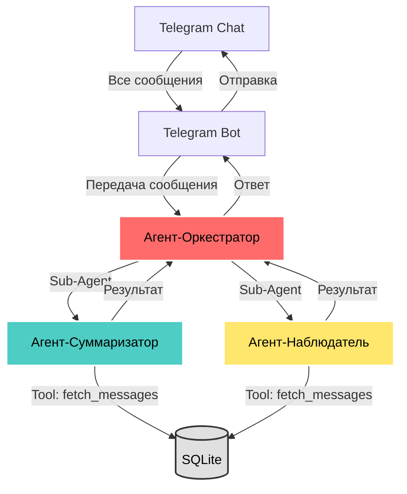

# Дизайн Мультиагентной Системы

## Цель

Описание архитектуры агентов и их взаимодействия.

---

## Схема Взаимодействия

---

## Иерархия Агентов

### Главный Агент
**Агент-Оркестратор** — центральный координатор системы.

### Специализированные Агенты (Sub-Agents)
1. **Chat Summarizer** — суммаризация чата
2. **Chat Observer** — поиск сообщений и ответы на вопросы

### Вспомогательные Агенты
**Simple Summarizer** — генерация саммари (используется через AgentTool в Chat Summarizer).

---

## Взаимодействие Компонентов

### 1. Telegram Bot → Оркестратор
- **Вход**: Текстовое сообщение из чата.
- **Действие**: Передача в Агент-Оркестратор.
- **Выход**: Ответ от оркестратора.

### 2. Оркестратор → Специализированные Агенты
- **Роутинг**: Определяет тип запроса (natural language).
- **Вызов**: Использует агенты как sub-agents.
- **Контекст**: Передает chat_id и параметры.

### 3. Специализированные Агенты → Tools/БД
- **Chat Summarizer** → `fetch_messages` (SQLite).
- **Chat Observer** → `fetch_messages` (SQLite).

---

## Детали Агентов

### Агент-Оркестратор
- **Роль**: Главный координатор.
- **Sub-Agents**: Chat Summarizer, Chat Observer.
- **Память**: InMemorySessionService (`chat_id` = `session_id`).
- **Natural Language**: Понимает запросы без команд.

### Chat Summarizer
- **Роль**: Получение сообщений + создание саммари.
- **Tools**: `fetch_messages`.
- **Направление**: Читает из SQLite → Генерирует саммари → Возвращает в Telegram.

### Chat Observer
- **Роль**: Поиск сообщений в истории и ответы на вопросы (QA).
- **Tools**: `fetch_messages`.
- **Фильтры**: Автор, дата, ключевые слова.

---

## Хранение Данных

### SQLite (`data/db/chat_messages.db`)
- Сырые сообщения (message_id, chat_id, user_id, text, timestamp).
- История чата.
- Метаданные.

### File System (`data/media/`)
- Медиа файлы (голосовые, изображения).
- Транскрипции голосовых.

---

## Изоляция по chat_id

**Критически важно**: Каждый чат видит только свои данные.

**Реализация**:
1. Все запросы к БД фильтруются по `chat_id`.
2. Сессии привязаны к `chat_id`.

**Проверка изоляции**:
- Unit тесты проверяют фильтрацию.
- Manual тестирование.

---

## Паттерны Реализации

### Sub-Agents Pattern (Orchestrator)
- LLM-driven delegation.
- Автоматический роутинг.
- Контекст через shared session.

**Референс**: [ADK Coordinator Pattern](https://google.github.io/adk-docs/agents/multi-agents/#coordinatordispatcher-pattern)

---

## Стратегия Управления Сессиями (Session Management)

**InMemorySessionService** используется для управления сессиями агентов. Поддерживаются два режима работы:

### 1. Через Оркестратор (Stateful)
*`session_id = chat_id`*

В этом режиме агенты сохраняют контекст диалога:
*   **Orchestrator**: Хранит историю чата, чтобы понимать уточнения и продолжать диалог.
*   **Chat Observer**: Наследует `session_id` оркестратора; помнит предыдущие запросы поиска/QA.
*   **Chat Summarizer**: Получает `session_id` оркестратора, чтобы учитывать ход разговора при суммаризации.
*   **Simple Summarizer**: Работает как AgentTool внутри Chat Summarizer, разделяет его контекст.

### 2. Прямые вызовы сервисов (Stateless)
*`session_id = новый UUID на каждый запуск`*

Используется для независимых задач:
*   **Chat Summarizer**: `run_summarizer` / `run_document_summarizer` создают уникальные сессии. Каждое саммари — независимая задача.
*   **Simple Summarizer**: Получает временный UUID, обрабатывает только переданный текст.
*   **Orchestrator / Chat Observer**: В этом режиме напрямую обычно не вызываются.

> Если `session_id` не передан явно, `run_agent_sync` сгенерирует UUID (stateless по умолчанию).

## Технические Детали

Полное описание реализации см. в:
- [Технические Требования](../requirements/technical-requirements.md)
- [Продуктовые Требования](../requirements/multi-agent-system.md)
