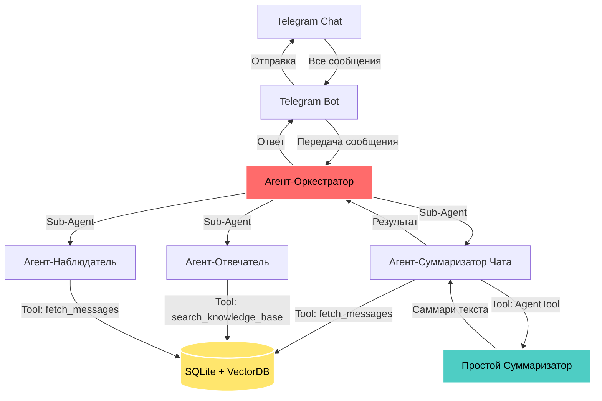

# Дизайн Мультиагентной Системы

## Цель

Описание архитектуры агентов и их взаимодействия.

---

## Схема Взаимодействия

---

## Иерархия Агентов

### Главный Агент
**Агент-Оркестратор** — центральный координатор системы

### Специализированные Агенты (Sub-Agents)
1. **Chat Summarizer** — суммаризация чата
2. **QA Agent** — ответы на вопросы
3. **Chat Observer** — поиск сообщений

### Вспомогательные Агенты
**Simple Summarizer** — генерация саммари (используется через AgentTool)

---

## Взаимодействие Компонентов

### 1. Telegram Bot → Оркестратор
- **Вход**: Текстовое сообщение из чата
- **Действие**: Передача в Агент-Оркестратор
- **Выход**: Ответ от оркестратора

### 2. Оркестратор → Специализированные Агенты
- **Роутинг**: Определяет тип запроса (natural language)
- **Вызов**: Использует агенты как sub-agents
- **Контекст**: Передает chat_id и параметры

### 3. Специализированные Агенты → Tools/БД
- **Chat Summarizer** → `fetch_messages` (SQLite) + Simple Summarizer (AgentTool)
- **QA Agent** → `search_knowledge_base` (VectorDB)
- **Chat Observer** → `fetch_messages` (SQLite)

---

## Детали Агентов

### Агент-Оркестратор
- **Роль**: Главный координатор
- **Sub-Agents**: Chat Summarizer, QA Agent, Chat Observer
- **Память**: InMemorySessionService (`chat_id` = `session_id`)
- **Natural Language**: Понимает запросы без команд

### Chat Summarizer
- **Роль**: Получение сообщений + создание саммари
- **Tools**: `fetch_messages`, Simple Summarizer (AgentTool)
- **Направление**: Читает из SQLite → Генерирует саммари → Возвращает в Telegram

### Simple Summarizer
- **Роль**: Генерация саммари текста
- **Tools**: Нет (только LLM)
- **Использование**: Через AgentTool из Chat Summarizer

### QA Agent
- **Роль**: Ответы на вопросы из БЗ
- **Tools**: `search_knowledge_base`
- **Особенность**: Честно говорит "я не знаю"

### Chat Observer
- **Роль**: Поиск сообщений в истории
- **Tools**: `fetch_messages`
- **Фильтры**: Автор, дата, ключевые слова

---

## Хранение Данных

### SQLite (`data/db/chat_messages.db`)
- Сырые сообщения (message_id, chat_id, user_id, text, timestamp)
- История чата
- Метаданные

### ChromaDB (`data/vector_store/`)
- Векторные представления сообщений
- Метаданные: `chat_id`, `timestamp`, `author`
- Используется для semantic search

### File System (`data/media/`)
- Медиа файлы (голосовые, изображения)
- Транскрипции голосовых

---

## Изоляция по chat_id

**Критически важно**: Каждый чат видит только свои данные.

**Реализация**:
1. Все документы в VectorDB содержат `chat_id` в метаданных
2. Все tools фильтруют данные по `chat_id`
3. Сессии привязаны к `chat_id`

**Проверка изоляции**:
- Unit тесты проверяют фильтрацию
- Eval тесты с разными chat_id
- Manual тестирование через `adk web`

---

## Паттерны Реализации

### Sub-Agents Pattern (Orchestrator)
- LLM-driven delegation
- Автоматический роутинг
- Контекст через shared session

**Референс**: [ADK Coordinator Pattern](https://google.github.io/adk-docs/agents/multi-agents/#coordinatordispatcher-pattern)

### AgentTool Pattern (Simple Summarizer)
- Инкапсулированная задача
- Изолированный контекст
- Переиспользуемость

**Референс**: [ADK Agent Hierarchy](https://google.github.io/adk-docs/agents/multi-agents/#agent-hierarchy-parent-agent-sub-agents)

---

## Технические Детали

Полное описание реализации см. в:
- [Технические Требования](../requirements/technical-requirements.md)
- [Продуктовые Требования](../requirements/multi-agent-system.md)
