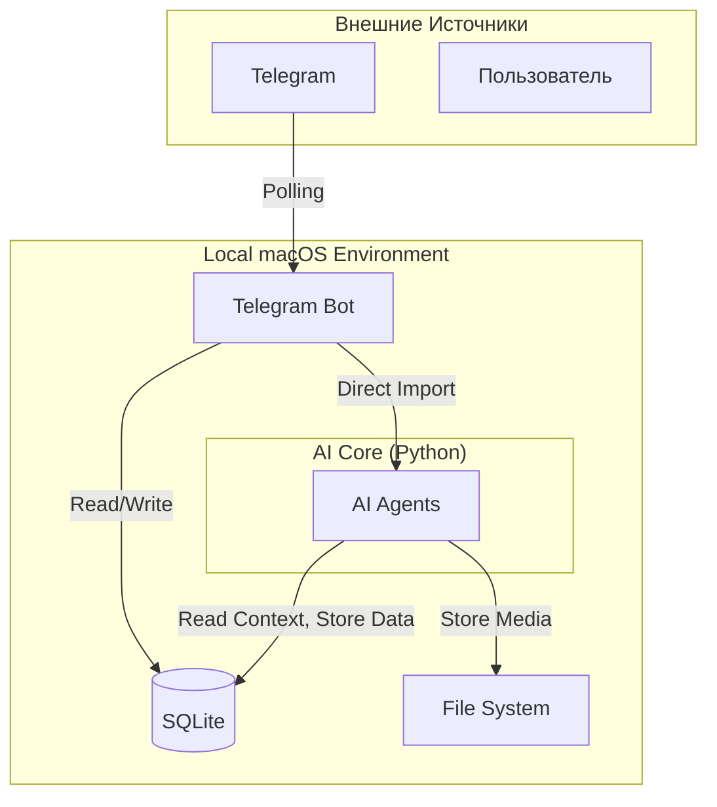

# Обзор Системы: Mesh Mind

## Назначение

Интеллектуальный ассистент для автоматической обработки и поиска информации из:
- Telegram чатов (текст + голосовые сообщения)

---

## Архитектура

Система состоит из двух основных компонентов, работающих на macOS локально (без Docker):

1. **Telegram Bot** — приложение для работы с Telegram API и AI Core
2. **AI Core** — библиотека с агентами и бизнес-логикой

### Схема Взаимодействия



---

## Компоненты

### 1. Telegram Bot

**Стек**: Python, `python-telegram-bot` v20+

**Режим работы**: Long Polling (не Webhook)

**Функции**:
- Получает все сообщения из чатов
- Обрабатывает команды (`/start`, `/help`)
- Напрямую вызывает функции AI Core
- Отправляет ответы пользователям

**Запуск**: `python telegram_bot/main.py`

---

### 2. AI Core

**Стек**: Python 3.10+, Google ADK

**Подкомпоненты**:

#### AI Agents (Google ADK)
Мультиагентная система:
- **Orchestrator** — центральный координатор
- **Chat Summarizer** — суммаризация чата
- **Chat Observer** — поиск сообщений и ответы на вопросы

Детали см. [multi-agent-design.md](./multi-agent-design.md)

---

## Хранение Данных

### SQLite (`data/db/chat_messages.db`)
- Сырые сообщения из телеграм
- Метаданные (chat_id, author_id, author_nick, author_name, timestamp, media_path/type)
- История чата

### File System (`data/`)
```
data/
├── media/
│   ├── voice/      # Голосовые сообщения
│   ├── images/     # Изображения
│   └── docs/       # Документы
├── db/             # SQLite файлы
```

---

## Технологии

**Языки**:
- Python 3.10+

**Основные Библиотеки**:
- Google ADK — для создания агентов
- python-telegram-bot v20+ — Telegram integration
- SQLite — реляционная БД

**Модели**:
- `gemini-2.5-flash` (для агентов)
- Whisper / Gemini (для транскрипции голосовых)

---

## Запуск Системы

### Локальная разработка

1. **Telegram Bot**:
   ```bash
   make bot
   ```

### Использование Makefile

```bash
make help          # Список всех команд
make install       # Установка зависимостей
make test          # Запуск тестов
make bot           # Запуск Telegram бота
```

---

## Детальная Документация

**Требования**:
- [Продуктовое Видение](../requirements/product-vision.md)
- [Мультиагентная Система](../requirements/multi-agent-system.md)
- [Технические Требования](../requirements/technical-requirements.md)

**Архитектура**:
- [Дизайн Агентов](./multi-agent-design.md)
- [Структура Проекта](./project-structure.md)

**Разработка**:
- [Правила для Агентов](../../agent_template/rules/)
- [Workflows](../../agent_template/workflows/)
