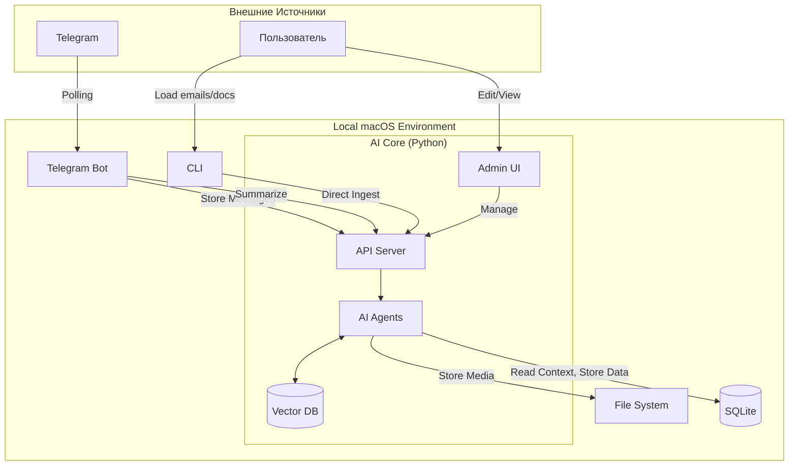

# Обзор Системы: Mesh Mind

## Назначение

Интеллектуальный ассистент для автоматической обработки и поиска информации из:
- Telegram чатов (текст + голосовые сообщения)
- Email писем (.eml файлы)
- Документов (PDF, DOCX, TXT)

---

## Архитектура

Система состоит из трех основных компонентов, работающих на macOS локально (без Docker):

1. **Telegram Bot** — отдельное приложение для работы с Telegram API
2. **AI Core** — центральный сервис с агентами, API и UI
3. **CLI Tools** — инструменты для массовой загрузки данных

### Схема Взаимодействия



---

## Компоненты

### 1. Telegram Bot

**Стек**: Python, `python-telegram-bot` v20+

**Режим работы**: Long Polling (не Webhook)

**Функции**:
- Получает все сообщения из чатов
- Обрабатывает команды (`/ask`, `/summary`, `/help`)
- Передает сообщения в AI Core через API
- Отправляет ответы пользователям

**Запуск**: `python telegram_bot/bot.py`

---

### 2. AI Core

**Стек**: Python 3.10+, Google ADK, FastAPI, Streamlit, ChromaDB

**Подкомпоненты**:

#### a) API Server (FastAPI)
Универсальные endpoints:
- `/ingest` — прием и сохранение данных
- `/chat/message` — обработка сообщений через агентов
- `/summary` — создание саммари
- `/ask` — вопросы к БЗ
- `/transcribe` — транскрипция голосовых (uk, ru, en)

**Запуск**: `make run-api`

#### b) Admin UI (Streamlit)
Интерфейс для управления БЗ:
- Просмотр содержимого Vector DB
- Поиск по базе знаний
- Редактирование/удаление записей
- Ручная загрузка документов
- Тегирование документов

**Запуск**: `make run-ui`

#### c) AI Agents (Google ADK)
Мультиагентная система:
- **Orchestrator** — центральный координатор
- **Chat Summarizer** — суммаризация чата
- **QA Agent** — ответы на вопросы
- **Chat Observer** — поиск сообщений

Детали см. [multi-agent-design.md](./multi-agent-design.md)

---

### 3. CLI Tools

**Функции**:
- Массовая загрузка email (.eml файлов)
- Массовая загрузка документов
- Административные задачи

**Запуск**: `python cli/main.py ingest --path ./data/emails`

---

## Хранение Данных

### SQLite (`data/db/chat_messages.db`)
- Сырые сообщения из телеграм
- Метаданные (chat_id, user_id, timestamp)
- История чата

### ChromaDB (`data/vector_store/`)
- Векторные представления для semantic search
- Метаданные: `chat_id`, `timestamp`, `author`
- Изоляция по `chat_id`

### File System (`data/`)
```
data/
├── media/
│   ├── voice/      # Голосовые сообщения
│   ├── images/     # Изображения
│   └── docs/       # Документы
├── db/             # SQLite файлы
└── vector_store/   # ChromaDB
```

---

## Технологии

**Языки**:
- Python 3.10+

**Основные Библиотеки**:
- Google ADK — для создания агентов
- FastAPI — API server
- Streamlit — UI
- python-telegram-bot v20+ — Telegram integration
- ChromaDB — векторная БД
- SQLite — реляционная БД

**Модели**:
- `gemini-2.5-flash` (для агентов)
- Whisper / Gemini (для транскрипции голосовых)

---

## Запуск Системы

### Локальная разработка

1. **Telegram Bot**:
   ```bash
   make bot
   ```

2. **AI Core API**:
   ```bash
   make run-api
   ```

3. **Admin UI** (опционально):
   ```bash
   make run-ui
   ```

### Использование Makefile

```bash
make help          # Список всех команд
make install       # Установка зависимостей
make test          # Запуск тестов
make run-bot       # Запуск Telegram бота
make run-api       # Запуск API сервера
```

---

## Детальная Документация

**Требования**:
- [Продуктовое Видение](../requirements/product-vision.md)
- [Мультиагентная Система](../requirements/multi-agent-system.md)
- [Технические Требования](../requirements/technical-requirements.md)

**Архитектура**:
- [Дизайн Агентов](./multi-agent-design.md)
- [Структура Проекта](./project-structure.md)

**Разработка**:
- [Правила для Агентов](../../agent_template/rules/)
- [Workflows](../../agent_template/workflows/)
