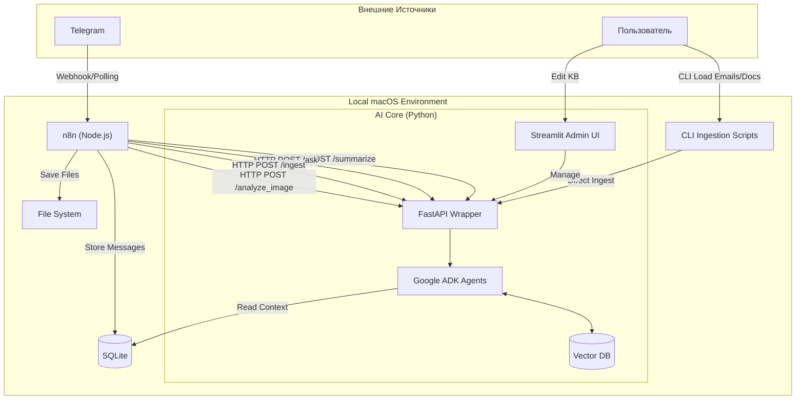
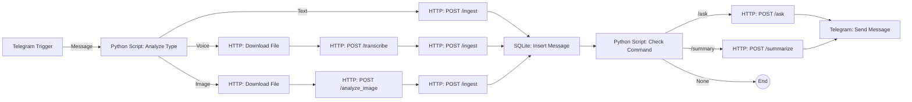

# Технический Дизайн: Intelligent Summarizer PoC

## 1. Обзор Архитектуры

Решение состоит из локальных компонентов, работающих на macOS. Docker не используется.

1.  **Оркестратор (n8n):** Управляет потоками сообщений от Telegram и файловой системы. Использует **Python Script Nodes** для логики.
2.  **AI Core (Python Service):** Локальный сервер (FastAPI) + UI (Streamlit). Содержит логику агентов (Google ADK), работу с LLM и Базой Знаний.
3.  **CLI Tools:** Скрипты для массовой загрузки данных (Email, архивы документов).

**Хранение данных:**
- **SQLite:** Хранение сырых сообщений, логов и метаданных.
- **Local Vector Store (ChromaDB):** Векторная база знаний (KB). Хранит чанки документов, писем и **сообщений из чата** для RAG.
- **Local Filesystem:** Хранение медиа-файлов и документов.
    *   Изображения: `data/media/images/{YYYY}/{MM}/{DD}/{file_id}.jpg`
    *   Голосовые: `data/media/voice/{YYYY}/{MM}/{DD}/{file_id}.ogg`
    *   Документы: `data/docs/{filename}`

## 2. Детали Компонентов

### 2.1. n8n (Оркестратор)
**Установка:** `npm install -g n8n`
**Запуск:** `n8n start`
**Важно:** Для любой кастомной логики внутри n8n использовать **Python Script Node**.

#### Детальный флоу: Обработка Telegram
Логика обработки сообщений разделена на этапы для надежности.

**Ноды:**
1.  **Telegram Trigger:** Получает сообщения (Polling или Webhook).
2.  **Python Script (Router):** Определяет тип контента (текст, голос, фото).
3.  **HTTP Request (AI Core):**
    *   `/transcribe` - Gemini Audio для голоса.
    *   `/analyze_image` - Gemini Vision для получения описания картинки.
    *   `/ingest` - **Важно:** Отправляем текст сообщения (или транскрипцию/описание) в Vector DB для RAG.
    *   `/ask` - если обнаружена команда вопроса.
    *   `/summarize` - если запрошено саммари (команда `/summary`).
4.  **SQLite Node:** Сохраняет сырое сообщение (и путь к файлу) в БД `messages` для истории.

#### Флоу: Загрузка Документов (Folder Watcher)
*   **Trigger:** Local File Trigger (следит за папкой `~/mesh-mind/input_docs`).
*   **Action:**
    *   Python Script: Читает файл.
    *   HTTP Request: `POST /ingest` (отправляет текст/файл в AI Core).

### 2.2. AI Core (Google ADK + Python)
**Стек:** Python 3.10+, Google ADK, FastAPI, Streamlit, ChromaDB.

**Компоненты:**

1.  **API Server (FastAPI):**
    *   `POST /summarize`: Запускает Summarizer Agent.
    *   `POST /ask`: Запускает QA Agent.
    *   `POST /ingest`: Принимает текст/файлы + метаданные (source, author, timestamp). Создает эмбеддинги, сохраняет в ChromaDB.
    *   `POST /transcribe`: Использование Gemini Audio (Multimodal) для транскрибации.
    *   `POST /analyze_image`: Использование Gemini Vision для описания изображений.

2.  **Admin UI (Streamlit):**
    *   Позволяет просматривать содержимое Vector DB (чанков).
    *   Поиск по базе знаний (для проверки ответов).
    *   Редактирование/Удаление устаревших записей.
    *   Ручная загрузка документов.

3.  **Agents (ADK):**
    *   **Summarizer:** Читает `messages` из SQLite (или последние N сообщений), генерирует отчет.
    *   **QA Bot:** RAG (Retrieval Augmented Generation) по ChromaDB. Ищет ответы и в документах, и в истории чата.

### 2.3. CLI Tools (Загрузка данных)
Скрипты на Python для начальной инициализации и массовой загрузки.

1.  `ingest_emails.py`:
    *   Читает `.eml` файлы.
    *   Парсит структуру (From, Subject, Body).
    *   **Определяет роль:** Client vs Employee (по домену email).
    *   Вызывает API `/ingest` (или использует общую библиотеку) для сохранения в ChromaDB с метаданными.
2.  `ingest_docs.py`:
    *   Рекурсивно обходит папку с документами (PDF, MD, TXT).
    *   Отправляет в API.

## 3. План Реализации

1.  **Подготовка окружения:**
    *   `python3 -m venv venv`
    *   `pip install google-adk fastapi uvicorn streamlit chromadb`
    *   `npm install -g n8n`

2.  **Разработка AI Core:**
    *   Настройка Google ADK и Gemini.
    *   Реализация RAG (ChromaDB) с поддержкой метаданных.
    *   API эндпоинты (включая `/analyze_image`).
    *   Streamlit UI для управления знаниями.

3.  **Разработка CLI:**
    *   Скрипт импорта email с логикой ролей.

4.  **Настройка n8n:**
    *   Настройка Python Script Nodes.
    *   Создание воркфлоу Telegram (с ветками для Text, Voice, Image).
    *   Создание воркфлоу File Watcher.

## 4. Проверка Требований
- [x] **Локальный запуск (macOS):** Да.
- [x] **Без Docker:** Да.
- [x] **n8n + Python Script:** Используется для оркестрации.
- [x] **Google ADK:** Логика агентов.
- [x] **Загрузка Email:** Через CLI.
- [x] **Редактирование КБ:** Через Streamlit UI.
- [x] **RAG по Чату:** Сообщения индексируются.
- [x] **Мультимодальность:** Голос и Картинки обрабатываются Gemini.
