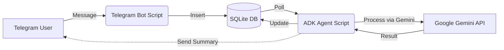

# Research: Telegram to Google ADK Local PoC

## 1. Simplest Architecture

For a local Proof-of-Concept (PoC) without Docker, a **Decoupled Producer-Consumer** architecture using a shared SQLite database is the simplest and most robust approach.

### Components
1.  **Ingestion Service (Telegram Bot)**:
    *   **Role**: Producer.
    *   **Action**: Long-polls Telegram for messages. Downloads text, audio, and images.
    *   **Output**: Writes raw data and file paths to a local SQLite database with status `PENDING`.
2.  **Local Storage (SQLite)**:
    *   **Role**: Persistence & Queue.
    *   **File**: `local_data.db`.
    *   **Schema**: Simple table `messages` (id, chat_id, text, file_path, type, status, analysis_result).
3.  **Processing Service (ADK Agent)**:
    *   **Role**: Consumer.
    *   **Action**: Polls SQLite for `PENDING` messages.
    *   **Logic**:
        *   Reads message/file.
        *   Sends to Google ADK Agent (Gemini).
        *   **Audio**: Transcribed by Gemini (Multimodal).
        *   **Image**: Recognized by Gemini (Multimodal).
        *   **Text**: Analyzed by Gemini.
    *   **Output**: Updates SQLite with `analysis_result` and sets status to `PROCESSED`.

### Diagram


### Feedback Loop (Delivery)
*   **Direct Send**: The **ADK Agent** (Consumer) will have access to the Telegram Bot Token.
*   **Action**: When a summary is generated, the Agent directly calls the Telegram API (`send_message`) to deliver the result to the user.
*   **Why**: Simpler than having the Bot poll the DB for "outgoing messages". The Agent knows exactly when the work is done.

## 2. Recommended Python Libraries

### Telegram: `python-telegram-bot`
*   **Why**: It is the standard, most mature library.
*   **Pros**: Excellent documentation, built-in handling for long-polling (`run_polling`), and easy file download helpers.
*   **Alternative**: `aiogram` is faster (asyncio-native) but slightly steeper learning curve for a "simplest possible" synchronous script (though `python-telegram-bot` v20+ is also async, it's very beginner-friendly).
*   **Recommendation**: Use `python-telegram-bot` (v20+).

### Google ADK: `google-adk` (and `google-generativeai`)
*   **Why**: You specifically requested "Google ADK agent". The `google-adk` library allows building structured agents.
*   **Note**: For the *absolute simplest* PoC, the standard `google-generativeai` SDK is easier to just "send text/file and get response". However, to satisfy the "ADK agent" requirement and future-proof for "logic/summary", `google-adk` is the correct choice.

## 3. Persistence Options

1.  **SQLite (Recommended)**
    *   **Why**: Built-in to Python (`import sqlite3`). Zero config. Supports concurrent reads (Bot writing, Agent reading). SQL allows easy "queue" logic (`SELECT * FROM msgs WHERE status='PENDING'`).
2.  **JSONL (JSON Lines)**
    *   **Why**: Human readable.
    *   **Drawback**: Concurrency is hard. If Bot writes while Agent reads, files can get corrupted. Not recommended for two separate processes.
3.  **Shelve**
    *   **Why**: Python dictionary-like persistence.
    *   **Drawback**: Not thread-safe/process-safe for concurrent write/read.

**Verdict**: **SQLite** is the only robust option for a 2-process architecture that remains "simple".

## 4. Feeding Stored Messages to ADK

The simplest way is a **Polling Loop** in the Agent script.

```python
# Pseudo-code for Agent Worker
import sqlite3
import time
from google_adk import Agent

agent = Agent(...)

while True:
    conn = sqlite3.connect('local_data.db')
    cursor = conn.cursor()
    # Fetch one pending message
    cursor.execute("SELECT id, text, file_path FROM messages WHERE status='PENDING' LIMIT 1")
    row = cursor.fetchone()
    
    if row:
        msg_id, text, file_path = row
        
        # Prepare input for ADK
        if file_path:
            # Load file (audio/image)
            response = agent.process_multimodal(file_path)
        else:
            response = agent.chat(text)
            
        # Save result
        cursor.execute("UPDATE messages SET status='PROCESSED', result=? WHERE id=?", (response, msg_id))
        conn.commit()
    else:
        time.sleep(1) # Wait for new messages
    conn.close()
```

## 5. Step-by-Step Plan

1.  **Setup Environment**:
    *   Create virtualenv.
    *   Install `python-telegram-bot`, `google-adk`, `google-generativeai`.
    *   Get API Keys (Telegram Bot Token, Google Gemini API Key).
2.  **Database Init**:
    *   Write `db.py` to create the `messages` table if it doesn't exist.
3.  **Build Telegram Bot (`bot.py`)**:
    *   Implement `/start`.
    *   Implement Message Handler (Text, Photo, Voice).
    *   On message: Download file (if any) -> Insert row into SQLite.
4.  **Build ADK Agent (`worker.py`)**:
    *   Initialize ADK Agent with a system prompt ("You are an analyzer...").
    *   Implement the polling loop (Read SQLite -> Call Agent -> Update SQLite).
    *   *Feature*: Ensure Agent prompt handles "Transcribe this audio" or "Describe this image" automatically (Gemini is multimodal, so just passing the file usually works, or add a wrapper prompt).
5.  **Run**:
    *   Terminal 1: `python bot.py`
    *   Terminal 2: `python worker.py`

## 6. Deep Dive: Multimodal Pipeline (Audio & Images)

To handle Voice and Images in the simplest way, we will leverage Gemini's **native multimodal capabilities** via the `google-genai` SDK (wrapped or used directly).

### Audio Transcription (Voice Messages)
Telegram voice messages are typically small.
*   **Size Context**: 1MB is roughly **1 to 5 minutes** of audio (depending on quality/device).
*   **Limit**: The Inline method supports up to **20MB**, which covers even very long voice notes (15+ minutes at high quality, 1+ hour at standard quality).
*   **Strategy**: **Inline Data**. No need for complex File API uploads for voice notes.
*   **Flow**:
    1.  **Bot**: Downloads OGG file to `downloads/voice/`.
    2.  **Agent**: Reads file bytes.
    3.  **Call**:
        ```python
        client.models.generate_content(
            model="gemini-2.0-flash",
            contents=[
                "Transcribe this audio exactly. Output only the text.",
                types.Part.from_bytes(data=audio_bytes, mime_type="audio/ogg")
            ]
        )
        ```
    4.  **Result**: Text string.
    *   **Note**: Gemini supports over 100 languages including Ukrainian and Russian automatically. We can enforce this by adding "Detect language and transcribe in the original language (Russian or Ukrainian)" to the prompt.

### Image Analysis
*   **Strategy**: **Inline Data**.
*   **Flow**:
    1.  **Bot**: Downloads JPG/PNG to `downloads/photos/`.
    2.  **Agent**: Reads file bytes.
    3.  **Call**:
        ```python
        client.models.generate_content(
            model="gemini-2.0-flash",
            contents=[
                "Analyze this image. Describe what you see.",
                types.Part.from_bytes(data=image_bytes, mime_type="image/jpeg")
            ]
        )
        ```

### "ADK Agent" Integration
While `google-genai` does the heavy lifting, to satisfy the "ADK Agent" requirement, we will structure the `worker.py` as an Agent that has a "tool" or "capability" to process these files, or simply wraps the GenAI call within the Agent's `process` method.

## 7. Batching & Summarization Strategy

To support "chat summary" logic, we introduce a **2-Stage Processing Pipeline**:

### Stage 1: Normalization (Immediate)
*   **Input**: Raw Text, Audio, Image.
*   **Action**: Transcribe Audio, Describe Images.
*   **Output**: All messages converted to text form. Status: `READY_FOR_SUMMARY`.

### Stage 2: Summarization (Batched)
*   **Triggers**:
    1.  **Time-based**: No new messages in chat for **60 seconds**.
    2.  **Command-based**: User sends `/summarize`.
*   **Logic**:
    *   Worker checks `READY_FOR_SUMMARY` messages for each chat.
    *   If `(now - last_msg_time > 60s)` OR `(last_msg == '/summarize')`:
        *   Fetch all pending messages.
        *   Send to Gemini: "Summarize this conversation: ..."
        *   **Send Result**: Worker sends the summary back to Telegram via Bot API.
        *   **Mark Complete**: Status `SUMMARIZED`.


