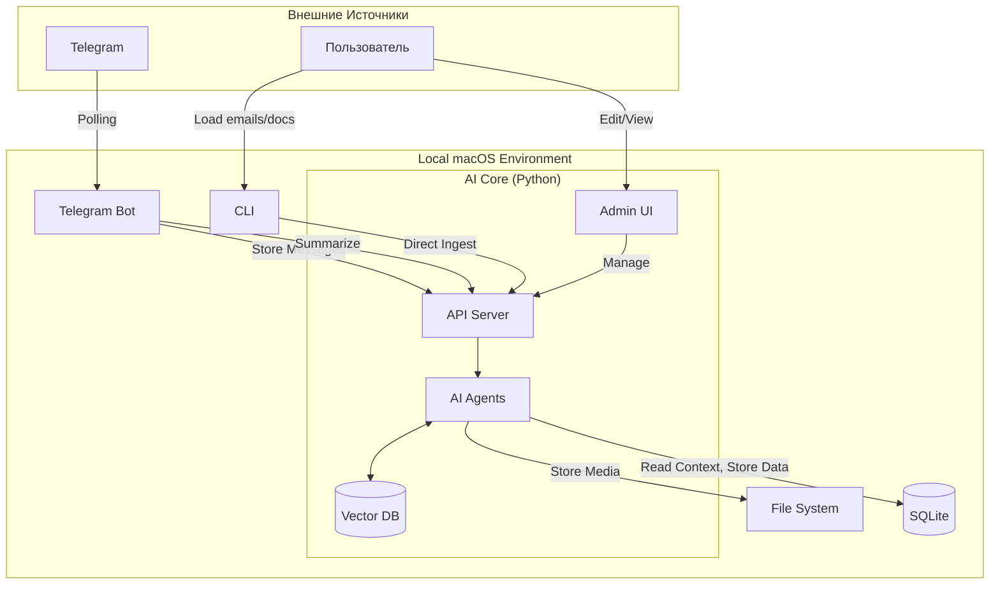

# Технический Дизайн: Intelligent Summarizer PoC

## 1. Обзор Архитектуры

Решение состоит из локальных компонентов, работающих на macOS. Docker не используется.

1.  **Telegram Bot (Python):** Отдельное простое приложение. Читает сообщения, сохраняет их и отправляет в AI Core.
2.  **AI Core (Python Service):** Локальный сервер (FastAPI) + UI (Streamlit). Содержит логику агентов (Google ADK), работу с LLM и Базой Знаний.
3.  **CLI Tools:** Скрипты для массовой загрузки данных (Email, архивы документов).

**Хранение данных:**
- **SQLite:** Хранение сырых сообщений, логов и метаданных.
- **Local Vector Store (ChromaDB):** Векторная база знаний (KB). Хранит чанки документов, писем и **сообщений из чата** для RAG.
- **Local Filesystem:** Хранение медиа-файлов и документов.

    *   Голосовые: `data/media/voice/...`
    *   Документы: `data/docs/...`

## 2. Детали Компонентов

### 2.1. Telegram Bot (Python App)
**Стек:** Python, библиотека `python-telegram-bot` (или `aiogram`).
**Запуск:** `python bot.py`

Простое приложение, которое работает в режиме Long Polling.

**Логика работы:**
1.  **Polling:** Получает обновления (Updates) от Telegram API.
1.  **Регарует на Команды в чате:**
    *   Обрабатывает `/ask` и `/summary`, вызывая соответствующие эндпоинты AI Core и отправляя ответ пользователю.
1.  **Видит все сообщения и медиа в чате, куда добавлен:** Передает сообщения и голосовые сообщения в API чтобы оно уже сохраняло их куда надо

### 2.2. AI Core (Google ADK + Python)
**Стек:** Python 3.10+, Google ADK, FastAPI, Streamlit, ChromaDB.

**Компоненты:**

1.  **API Server (FastAPI):**
    Система предоставляет набор универсальных точек входа: одна отвечает за создание кратких пересказов, другая — за получение ответов на вопросы, третья — за приём и структурированное сохранение новых данных, а также есть отдельные эндпоинты для обработки аудио (с поддержкой украинского, русского и английского языков). Всё это формирует единый интерфейс для работы с разнородной информацией и запуска соответствующих интеллектуальных процессов.

    **Примечание:** Конкретные спецификации API эндпоинтов будут описаны в отдельном документе.

2.  **Admin UI (Streamlit):**
    *   Позволяет просматривать содержимое Vector DB (чанков).
    *   Поиск по базе знаний (для проверки ответов).
    *   Редактирование/Удаление устаревших записей.
    *   Ручная загрузка документов.
    *   Тегирование документов (например, "Законы", "Регламенты").

3.  **Agents (ADK):**
    *   Здесь некоторое количество агентов, которые будут выполнять продуктовые задачи

### 2.3. CLI Tools (Загрузка данных)
Скрипты на Python для начальной инициализации и массовой загрузки.

1.  `ingest_emails.py`:
    *   Читает `.eml` файлы.
    *   Парсит структуру (From, Subject, Body).
    *   **Определяет роль:** Client vs Employee (по домену email).
    *   Вызывает API Server для сохранения в ChromaDB с метаданными.
2.  `ingest_docs.py`:
    *   Рекурсивно обходит папку с документами (PDF, MD, TXT).
    *   Отправляет в API.

